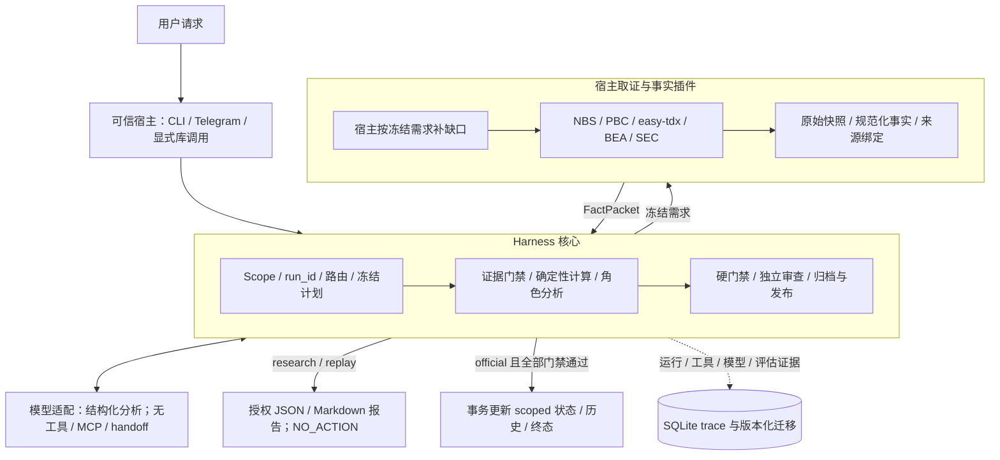
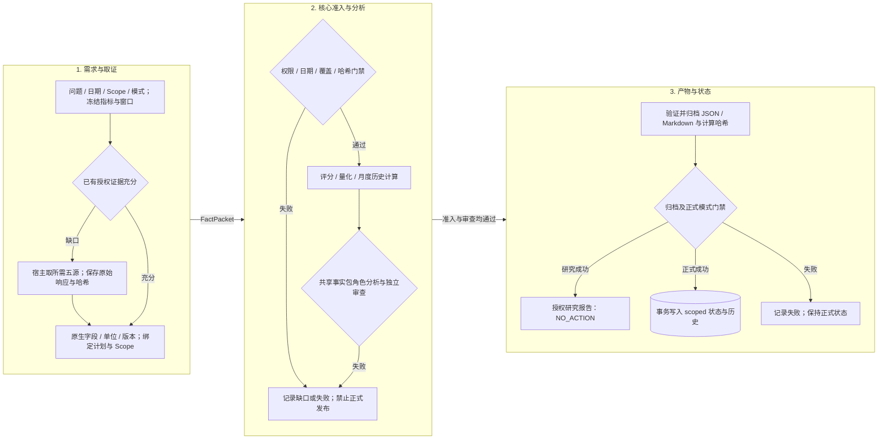
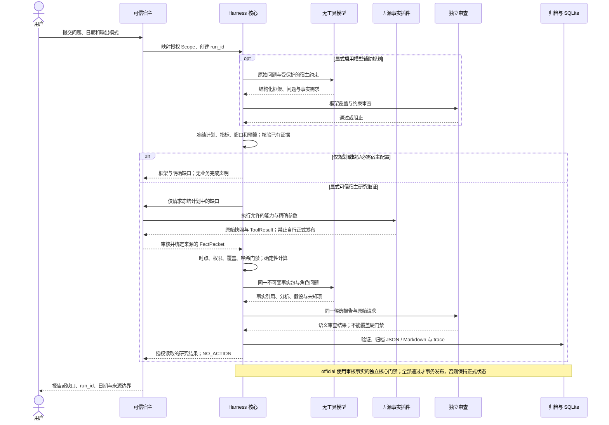

# a_share_claw

一个可由不同宿主调用、也可独立接入模型端点运行的 A 股投研 Harness。主体是投研契约、研究模板、工作流、评估与风控；入口、模型和数据源通过适配层接入。当前优先交付两条可审计的投研工作流：

1. 宏观日度评分与仓位纪律。
2. 行业链/公司研究与证据化辩论。

目标链路为：

`宿主/模型适配 -> 投研路由与框架 -> 数据需求与缺口 -> 按需数据插件 -> 契约校验 -> 分析/风控/评估 -> 可审计产物`

> **开发顺序**：E0 验收与未完成边界闭环 → 五个事实接口接入与来源验收 → 整合业务 case。当前 E0 最小清单已验收；五源所需能力的真实来源、冻结核心交接和完整 Q3 覆盖已验收；月度任务已加入 7/8 月历史事实对照，含历史输入的整合 Q4 条件展望已通过宿主复核定稿、核心计算与独立 SDK 审查，已随 [PR #2](https://github.com/le0820/a_share_claw/pull/2) 合并到 main（2026-10-01）。无人复核模型文案、历史缓存和自动月更仍未验收。当前状态和阶段退出条件以 [E0_INFRA.md](E0_INFRA.md#当前验收结论与阶段入口) 为准。

核心已有运行、冻结规划、确定性评分/风控、研究执行、统一报告和事务发布门禁。固定合成事实及有限真实模型检查只证明其验收范围；完整 Issue #1、一般语义质量、回测和连续正式日更仍未完成。插件只填充事实；默认五源为 NBS/PBC/easy-tdx/BEA/SEC；FRED 保留为显式可选，TickFlow 默认禁用。插件能力、真实接口边界及配置见 [DATA_PLUGINS.md](DATA_PLUGINS.md)。

## 顶层设计

- **Harness 核心**：维护数据与权限契约、研究模板、路由、评分、风险门禁，以及运行 trace 和硬门禁 evaluator。改进提案控制面仍待建设。核心不依赖 Telegram 用户 ID、某个模型 SDK 或具体数据供应商。
- **宿主与模型适配层**：Codex、Claude Code、Meta Muse、WorkBuddy 等环境是目标宿主；宿主可提供模型和工具执行能力，Harness 仍负责契约与正式产物门禁。独立模式通过模型 URL、模型名和端点需要的凭据运行。Telegram 是可选消息适配器，调度和通知不决定核心投研生命周期。
- **数据插件层**：先形成投研框架、输出模板和必需数据清单，再检查已有证据，最后仅接入补齐缺口所需的数据能力。量化行情、宏观序列、公司披露和搜索分别声明能力；无插件时仍能生成框架和缺口报告，必需证据不足时阻止正式评分或交易动作结论。

宿主适配和数据插件是两个独立扩展点；接入新宿主不需要重写投研框架，更换数据源不改变指标定义、评分权重或风控阈值。目标宿主清单表示设计兼容目标，逐个集成与端到端验收仍待完成。

完整边界、运行契约、热插拔语义和实施顺序见 [HARNESS_DESIGN.md](HARNESS_DESIGN.md)。数据时点、来源和替换限制以 [DATA_CONTRACT.md](DATA_CONTRACT.md) 为准。

## 当前框架与运行图

以下三图描述已实现的核心与显式可信宿主路径。普通 chat 当前只交付规划和缺口；图中的取证流程须由宿主显式配置。角色是投研职责，不表示六个常驻自主 Agent。

### 1. 项目框架图



### 2. 数据流转图



月度任务同时冻结当前发布与历史事实。核心计算相邻公布率的百分点变化，并保留版本限制；同比变化不能冒充环比，累计同比不能冒充单月增速。两个月对照仅证明相邻变化。不同发布版本不认证修订一致的历史趋势或历史 PIT。

### 3. 模型查询—分析—宿主工具调用—决策过程



“分析”指可审计的结构化结论、假设、引用和评估，不表示保存模型内部思维链。插件的 `official_output_allowed=false` 限制插件自身发布；核心重新核验后，只有显式 official 模式可以获得正式发布权。当前来源自动获取仅用于受支持的 research 工作流，不直连正式日评分。

## 当前边界

### 已有基础

- Telegram long polling 入口与白名单配置。
- OpenAI Agents SDK runner，以及国产 OpenAI 兼容端点配置。
- 宏观、量化、公司、行业和混合请求的确定性路由与工具 allowlist。
- 宏观日度评分管线、产业研究取证 gate 和旧 MCP 模块保留用于人工维护；均不再作为 Agent 取数入口。
- AI 行业仓位叠加层的增长状态 + 战术信号原型（独立于 L2）。

### 不能因此宣称完成

- 当前 `data/state/system_state.json` 的传统宏观正式状态仍停在 `20260713`；没有连续运行至当前市场日的正式宏观日更，不能把代码能力当作已稳定运行的服务。
- AI 叠加层的 `20260730` / `20260731` 信号为 `unverified` research replay，不更新正式状态，不能作为正式交易指令。
- L2 因子层按数据契约明确禁用；它不是待用动量或搜索结果替代的空位。
- 盘中/盘前正式收盘评分尚未实现；同日正式请求必须等待 A 股收盘门禁。

## 真实路线图与验收

完成状态只以“端到端可运行、符合数据契约、通过对应验收”判断；存在文件、类或单元测试不等于章节完成。

| 阶段 | 状态 | 目标 | 完成定义 |
| --- | --- | --- | --- |
| 1. 宿主适配 | 本地 CLI/Telegram 基础已具备；通用适配未完成 | 所有入口提交统一请求，使用同一核心门禁 | 无 Telegram 配置也能运行；外部宿主与 CLI 对同一输入产生一致的契约检查和 trace；身份/权限显式映射 |
| 2. 模型接入 | 独立 OpenAI 兼容端点基础已具备；宿主模型适配未完成 | 支持宿主提供模型或独立模型 URL 两种模式 | 核心不绑定模型 SDK；模型名、凭据引用、超时与预算明确；模型不可替代硬门禁 |
| 3. 投研执行平面 | **进行中** | 将策略、数据契约、研究路由和受约束工具闭环 | 宏观与产业研究均按日期、来源、fallback 输出；正式宏观日更恢复；AI P0/P1 只有在正式数据可用时写入状态 |
| 4. 数据插件与证据工作台 | 五源接口与入口限制已实现；显式研究交接已验收；默认 chat 绑定与正式评分自动接入未完成 | 从投研模板推导缺口，按需接入可替换的数据能力 | 零插件可规划；仅加载必要插件；插件增删不改核心；结果有统一 envelope、来源/时点校验与回放快照 |
| 5. 短期上下文管理 | 未完成 | 管理每个会话的上下文生命周期和 token 预算 | 有保留窗口、摘要/压缩、恢复策略、上下文预算和回归测试；不会因历史无限增长而失控 |
| 6. 长期记忆与隔离 | 未完成 | 只在允许的主体边界内检索、写入和注入记忆 | 采用 `workspace + principal + session + agent_key` 核心作用域，入口映射原 platform/user/chat；隔离、保留/删除和注入均有端到端测试 |
| 7. 任务与 Cron 调度 | 未完成 | 可靠地创建、执行、重试、观测和取消一次性/周期性投研任务 | 支持明确时区与 cron/固定周期语义，具备幂等、失败重试、并发/错过执行策略、状态查询与通知验收 |
| 8. 运行隔离与可观测性 | E0 trace/作用域门禁已实现；完整隔离与恢复未完成 | 将会话、任务、工具调用、数据产物和权限作为独立运行边界 | 身份授权、会话/任务/记忆/产物隔离一致；日志、指标、审计和故障恢复可验证 |
| 9. loop-engineer / 自提升 | 未开始 | 用受控评估驱动策略和流程改善，而不是让 Agent 自行改写生产规则 | 固定评测集、变更提案、回放、人工批准、版本化回滚和上线后监控齐备；无自动越权交易或修改数据契约 |

### 第 3 章当前工作

第 3 章包含此前所有策略相关开发：L1/L3 评分、L2 禁用与权重重归一、数据日期/来源契约、宏观/研究路由、MCP evidence gate，以及 AI 行业仓位叠加层。新的开发顺序先收口可复用投研框架与数据需求，再补数据插件；已有固定管线仅保留人工兼容入口，不能绕过 Agent 的插件限制。

最近已提交的 AI 战术加仓门禁除了流动性分位数，还要求 2Y、10Y、30Y 与 10Y TIPS 在同一五日窗口内均未上行，并且 Brent 不触发通胀冲击。其目的是避免“分位数看似宽松、绝对利率或油价实际恶化”时错误触发 `ADD`。新架构继续保留这些风险约束。

按新架构先收口框架/需求/E0，再接入数据插件。正式数据链路仍需完成以下业务验收：

1. 恢复连续、可审计的正式宏观日更；每份产物包含 `as_of_date`、数据源、发布日期/观测日期和 fallback 状态。
2. 验证 AI 当前日期的正式输入链路；历史 current-vintage 回放始终保持 `unverified`，不得写入正式状态。
3. 对宏观、量化、公司、行业与 mixed 路由完成真实请求的工具边界回归；不只验证 fake runner。
4. 将当前流动性门禁变更提交为可回滚的版本，并保存相应回放证据。

## 投研规则和数据边界

`DATA_CONTRACT.md` 是所有正式产物的最高数据规则。每份正式评分或研究必须声明：

- `as_of_date`、`generated_at`、`data_period`。
- 精确 source / file path / URL 与可得的 `source_timestamp` 或发布日期。
- `fallback_status`：`none`、`stale_fallback`、`static_fallback` 或 `unverified`。

硬性约束：

- 历史问题不得使用请求日期之后的数据；没有精确数据默认停止，不能静默回退。
- A 股交易日用 `ASCLAW_MARKET_TIMEZONE=Asia/Shanghai` 判断，用户时区用于宿主展示和任务调度。
- 同日正式收盘评分仅在 A 股收盘后可运行；盘前和盘中返回 `WAIT_FOR_CLOSE`。
- L2 保持 `disabled/null`，Composite 使用 `L1 × 4/7 + L3 × 3/7`。
- AI 策略中增长决定结构仓位；数据覆盖不足只能 `NO_ACTION`，不得转换成中性分数。

详见 [DATA_CONTRACT.md](DATA_CONTRACT.md) 和 [宏观运行手册](src/pipeline/OPERATIONS.md)。核心运行协议已版本化为 [RESEARCH_OPERATIONS.md](src/a_share_claw/RESEARCH_OPERATIONS.md)，由配置、Agent 上下文和核心政策快照共同引用。`data/deepresearch/OPERATIONS.md` 为部署档案，不再作为运行依赖；缺关键协议时在模型调用前停止。协议可加载不代表业务执行器已验收。

## 系统结构

```text
src/
  a_share_claw/             # 当前 Agent runner、路由、领域工具、SQLite 与可选入口
  compiled/                 # 版本化 L1/L2/L3/权重与 AI 策略规则
  pipeline/                 # 确定性数据获取、评分、报告与 AI 叠加层脚本
data/
  raw/                      # 按日期归档的原始输入
  analysis/                 # P1 风险/动量等中间结果
  scores/                   # L1/L2/L3/composite 结构化评分
  reports/                  # 日报
  factors/ai/ signals/ai/   # AI 叠加层的日期化因子与信号
  research/output/          # 产业研究输出
  state/system_state.json   # 最新正式状态；不是历史回放的写入目标
tests/                      # 现有单元与路由回归测试
```

`src/a_share_claw/` 是唯一运行实现；根目录 `a_share_claw/` 仅是兼容启动 shim。运行数据是审计证据，默认不作为代码提交物。

以上是当前目录，不代表核心/宿主/数据插件已经物理拆分。目标模块划分和兼容迁移见 [HARNESS_DESIGN.md](HARNESS_DESIGN.md)。

## 可观测执行与 HTML 报告（开发中）

核心运行增加 `react-boundary-v1` 阶段状态机：context → planning → evidence → compute → output → publish。代码约束合法后继，SQLite `run_steps` 保存成对开始/结束、公开决策码、输入/阶段事件哈希和时长；失败/取消结束当前阶段。规划模式从 planning 进入 publish。mixed 的子运行各自记录边界，父运行记录切片编排。公开摘要不是模型私有思维链。新增 `react-action-v1` 成对 span 覆盖来源、模型请求、角色及其校验、评价、证据准入、计算和归档；失败/取消原子闭合未结束 span，迟到回调不能续写终态。`harness ui` 展示公开决策码、输入哈希、观测与耗时。

成功业务报告新增 `report.html`，与 JSON/Markdown 在同 run/Scope 归档、哈希读取、确定性重渲染验证；HTML 失败阻止本次交付和正式状态更新。CLI `harness report RUN_ID --format html` 仅返回授权且校验通过的 HTML。旧报告没有 HTML 时明确返回缺失，不静默生成或改写历史产物。纯规划/缺口运行可由 `harness ui` 导出独立 HTML 诊断页；自动随所有终态生成该诊断页仍待补齐。

页面采用本地 CSS/SVG，呈现完整报告表格、已准入收盘序列和月度公布率对照，包含数值表和来源边界。无远程资源或脚本；模型/来源文案按文字转义。`chart_series` 来自核心价格准入后的原始序列，与统计同一输入哈希。

2026-10-02 当前捕获的真实四指数 Q3 取证、完整日历/锚点校验、收益/回撤独立复算、HTML 与工作台浏览已通过。验收位于 `data/harness_acceptance/market_visualization_20261002/acceptance.json`，保持 NO_ACTION，不证明历史 PIT 或第二行情商一致性。资金流向、申万一级轮动、所有终态的自动 HTML，以及真实模型普通 chat 整合验收仍未完成；无数据时不得造图或补零。

显式普通聊天配置使用 `InvestmentAgent(..., trusted_chat=TrustedChatProfile.parse(document))` 或 `chat --host-contract HOST.json --date YYYY-MM-DD`。`trusted-chat-host-v1` 恰含 schema_version、四字段 scope、as_of_date、workflow、parameters、source_contract；parameters 使用完整 research_spec / quant_spec / outlook_spec，source_contract 使用既有宿主审核绑定。主体、会话、日期、workflow 和规格在模型/来源调用前校验。默认 chat 仍无绑定；配置不会从消息文字或模型输出生成，模型仍无工具。合成 SDK+四来源端到端、缺源、改规格与跨 Scope 拒绝已验收，真实模型质量尚未验收。

`harness watch-plan --date DATE --window-start START --window-end END --cutoff TIMESTAMP --nyse-calendar FILE --nasdaq-calendar FILE --sse-calendar FILE --szse-calendar FILE` 只冻结四指数规格与来源合同，无网络取数。随后显式 `harness run quant --quant-spec FILE --source-contract FILE`；`harness ui --run-id RUN_ID --date DATE` 导出同 Scope 离线列表、诊断/时间轴和已校验报告链接。使用相同的 platform/user/chat/agent-key。HTML 快照没有运行/取数按钮或正式发布权限。

## 待办与下一会话入口

开发基线为原 PR #2 分支 `docs/portable-harness-data-plugins`；`develop` 是同步镜像，不作为第二条独立开发线。开发、来源验收和业务 case 通过后，经 PR 合并到 `main`，再快进同步两个开发引用；不强推或直接在 main 开发。

| 顺序 | 待办 / 当前状态 | 依赖与最小验收 |
| --- | --- | --- |
| 已完成 | E0 最小五项 → 五源选定能力 → 含历史的 Q4 case | PR #2 已合并；Python 3.11/3.12 各 479 passed / 41 subtests；真实 case 经宿主复核，保持 NO_ACTION |
| 下一步 | 显式普通 chat 配置已接线；真实模型整合、资金流向与申万一级轮动待验收 | 复用现有显式宿主适配器；先冻结规格，后取缺口；真实请求报告与无凭据/缺数据的正确阻止均验收，不给模型开放工具 |
| 随后 | E2：历史事实复用、月度更新与上下文生命周期 | 明确按 Scope/日期/版本重验和授权；跨运行/跨会话不能直接拼包；验收修订、缺月、跨主体、重复月更及恢复 |
| 并行质量工作 | E1 旧 ToolRuntime/MCP 结果迁移；E3 固定评测与故障归因 | 按实际迁移/质量缺口收口；覆盖因果越界、编造阈值、单位与版本误读；独立模型审查通过不替代人工质量验收 |
| 后续 | 五源补足日评分/AI 所需输入，恢复连续正式日更 | 当前来源仍不足以覆盖全部旧评分字段；缺必需数据不评分，L2 保持禁用；连续产物、状态事务和可审计回滚验收 |
| 后续 | 可靠调度/崩溃恢复、更多宿主、回测、E4/E5 改进控制面 | 依赖上述边界闭环；逐项单独验收，不因 E0 最小完成关闭 Issue #1 |

### 本会话纪要（2026-09-30—2026-10-01）

- 用户确定：先完成 infra 的验收和边界，再接五源事实接口，最后跑整合业务 case；插件不能决定评分、风控或正式发布。
- 默认源确定为 NBS / PBC / easy-tdx / BEA / SEC；SEC 联系配置仅保存在本机 `.env`，无密钥或配置值提交。FRED 仅显式可选，TickFlow 默认禁用。
- 本次整合了美国 8 月 PCE、中国 8 月发布及 7 月历史对照、纳斯达克综合/创业板/科创 50 完整 Q3，交付 Q4 条件展望。BEA 使用同一 8 月版本的 7/8 月历史比较表，不能混入年度更新前的 7 月旧值。
- 最终 case `208a8eaacdf74077ad34be2e2e901016` 为可信宿主定稿 + Tencent hy3 独立 SDK 审查；曾出现审查误放行，故无人复核文案仍未验收。正式状态未更新。
- PR #2 已合并；本轮撤销五项旧的未提交修改并同步分支，保留 `.env`、原始响应、失败记录和最终报告。具体证据、风险边界及新会话提示见 [SESSION_HANDOFF.md](SESSION_HANDOFF.md)。

新会话先读 README / IDENTITY / DATA_CONTRACT 和授权状态，再按任务需要读取 [SESSION_HANDOFF.md](SESSION_HANDOFF.md)、[E0_INFRA.md](E0_INFRA.md) 或运行协议；不要整包加载历史会话、报告与 trace。

## 快速开始（开发验证）

```bash
python -m venv .venv
source .venv/bin/activate
pip install -e .
cp .env.example .env
python -m a_share_claw init-db
ASCLAW_FAKE_AI=1 python -m a_share_claw chat "测试一下"
```

独立模型模式配置 `.env`，本地 `chat` 不需要 Telegram token：

```bash
# 国内 OpenAI 兼容端点；不配置时才回落到教程占位模型。
ASCLAW_MODEL_PROVIDER=tencent
ASCLAW_MODEL_BASE_URL=https://tokenhub.tencentmaas.com/v1
ASCLAW_MODEL_API_KEY=sk-...
ASCLAW_MODEL_NAME=hy3
ASCLAW_OPENAI_MODEL=gpt-5.5

# 宿主展示/任务的用户时区，与 A 股市场日期边界分离。
ASCLAW_TIMEZONE=America/Los_Angeles
ASCLAW_MARKET_TIMEZONE=Asia/Shanghai
```

```bash
python -m a_share_claw chat "先梳理宏观日度评分框架和所需数据"
```

模型 URL 须符合当前 OpenAI 兼容协议，并配置端点接受的模型名与必要凭据。未来由外部宿主提供模型时无需另配模型 URL；统一宿主协议尚未实现。模型接入也不会自动补齐投研所需的真实数据。

查看不含密钥的生效配置：

```bash
python -m a_share_claw show-config
```

可选 Telegram 入口：先在 `.env` 中配置以下两项，再启动当前的轮询调度原型。

```dotenv
TELEGRAM_BOT_TOKEN=123456:...
TELEGRAM_ALLOWED_USER_IDS=123456789
```

```bash
python -m a_share_claw run
```

显式 `run` 启动可选 Telegram 适配；不带子命令只显示帮助。`data plugins/plan/fetch` 是模型无关宿主入口，注册表支持库级热插拔。

> Telegram 在需要代理的网络环境中使用 `HTTPS_PROXY` / `HTTP_PROXY`；模型客户端默认 `trust_env=False` 并直连国产端点。若确实需要让模型走系统代理，设置 `ASCLAW_MODEL_TRUST_ENV=1`，并确认已安装 `socksio`。

## 第 3 章运行入口

先使用核心入口验证运行逻辑与评分策略，事实包、回放和验收范围见 [E0_INFRA.md](E0_INFRA.md)：

```bash
uv sync --locked --extra dev
uv run python -m a_share_claw harness plan --workflow macro --date 2026-07-13
uv run python -m a_share_claw harness run facts.json --workflow macro --date 2026-07-13
uv run python -m a_share_claw trace RUN_ID
uv run python -m a_share_claw harness report RUN_ID --format markdown
```

默认回放只产生 NO_ACTION。正式模式只接收经过操作人审核的规范化事实，按作用域与 workflow 原子更新 SQLite 状态；公司/行业核心库入口可注入受信任的角色执行和独立语义评估回调；CLI 显式 SDK 执行可用；独立 price_statistics 与 outlook 路径已接线；mixed 已接线，普通 chat 已接核心异步入口；五源事实映射、真实业务质量和策略回测待验收，固定合成模型验收范围见 E0_INFRA.md。插件不得修改核心规则。

公司/行业研究需由受信任宿主提供审核事实与冻结研究规格。显式使用已配置端点执行角色和独立评估：

```bash
uv run python -m a_share_claw harness plan --workflow industry --date 2026-07-13 --research-spec spec.json
uv run python -m a_share_claw harness run facts.json --workflow industry --date 2026-07-13 --research-spec spec.json --mode research --model-executor configured
```

模型辅助框架编译先校验宿主约束并独立评估，不加载插件或获取事实：

```bash
uv run python -m a_share_claw harness plan --workflow industry --date 2026-07-13 --question "梳理产业链价值捕获、证据需求和风险边界" --model-executor configured
uv run python -m a_share_claw harness plan --workflow outlook --date 2026-07-14 --question "形成条件市场展望框架" --planning-constraints constraints.json --model-executor configured
```

constraints.json 固定实际仓位或量化/预测窗口等宿主条件，详见 [框架编译](E0_INFRA.md#模型辅助框架编译)。成功 plan 仅表示 framework_only，缺口与必需能力仍须填充。同步宿主 plan_core_result 可规划；run_core_result(..., compile_framework=True, planning_constraints=...) 可在同一 run 内编译后消费宿主审核的事实包。普通 chat 已接核心异步规划/缺口入口；显式可信宿主可用 PluginEvidenceAdapter 完成已声明能力的取证和交接，普通聊天的默认来源配置仍待接线。

`spec.json` 字段见 [E0_INFRA.md](E0_INFRA.md#显式-sdk-研究执行入口)。未指定 executor 的 plan 不调用模型，也不会自动连接端点。配置端点必须显式给出 provider/base URL/model name/API key，不回落到 SDK 全局默认客户端。模型无取数/文件/MCP 工具，输出仍经过核心校验与发布门禁。普通 chat 的自由文案不能构造审核事实包；显式宿主使用审核绑定，普通聊天的自动配置仍待接线。

异步宿主 `run_core_result_async(..., packet=..., workflow=..., compile_framework=True)` 使用同一核心 run；取消会传播至当前模型和 mixed 子运行，核心记录终态后才结束等待。数值规格在 planning_constraints 中固定。普通 run_result 不接受事实包或 official 模式；当前自动回复是核心冻结计划及明确缺口，默认来源绑定完成前不调用来源。旧模型选源/六工具循环与 SDK 全局默认客户端路径已移除，取源 CLI 保留独立研究边界。详见 [异步入口验收](E0_INFRA.md#异步宿主与普通-chat-核心入口)。

价格统计使用独立规格与 price_history，不使用日评分固定标的：

```bash
uv run python -m a_share_claw harness plan --workflow quant --date 2026-07-14 --quant-spec quant.json
uv run python -m a_share_claw harness run facts.json --workflow quant --date 2026-07-14 --quant-spec quant.json --mode research
uv run python -m a_share_claw harness run outlook-facts.json --workflow outlook --date 2026-07-14 --outlook-spec outlook.json --mode research --model-executor configured
uv run python -m a_share_claw harness plan --workflow mixed --date 2026-07-13 --mixed-spec mixed-spec.json
uv run python -m a_share_claw harness run mixed-facts.json --workflow mixed --date 2026-07-13 --mixed-spec mixed-spec.json --mode research --model-executor configured
```

成功运行会归档 report.json 与 report.md；任一渲染/验证/归档失败都不能发布。`harness report RUN_ID --format markdown --date YYYY-MM-DD` 在读取前检查授权作用域、成功终态、必需 evaluator、JSON/Markdown 哈希和归档绑定，并从正式历史事务决定 published/research；文件中的 staged 标记不自行变成正式发布。`--format json` 返回同一读取结果的结构化内容。同步宿主可用 `InvestmentAgent.read_core_report(context, run_id, as_of_date=...)`；异步宿主可用 run_core_result_async；普通 chat 已接核心规划与缺口门禁，默认来源绑定尚未接线；显式可信宿主的冻结来源交接已验收。

以上文件由受信任宿主提供，字段见 [价格统计与宏观展望](E0_INFRA.md#独立价格统计与宏观展望)。月度新发布分析必须同时冻结历史对照（research_spec.monthly_history），按指标、国家、月份、单位和版本匹配；历史缺失时不交付趋势判断。现有无历史规格保留为单期事实研究入口，不表示月度更新验收完成。历史比较不调用模型做数值计算；详情见 DATA_PLUGINS.md 的月度历史事实包段落。统计与展望输出保持 NO_ACTION，不生成缺少输入的日度分数。本次三指数 Q3 日历和原生数据身份已验收；其他标的/期间必须重新验收，短窗口不能冒充完整季度。

以下旧命令仅供人工维护，仍包含五源以外的旧供应商。Agent 不得调用；迁移为插件输入前，不属于五源 Harness 的正式输出路径。历史计算回归保留，日期与风控约束不变：

```bash
AS_OF_DATE=YYYYMMDD
cd src/pipeline
uv sync
uv run python fetch_etf_data.py --days 500
uv run python fetch_macro.py --date "$AS_OF_DATE"
uv run python fetch_us_macro.py --date "$AS_OF_DATE"
uv run python p1_upgrade.py --date "$AS_OF_DATE"
uv run python run_scoring.py --date "$AS_OF_DATE"
uv run python generate_daily_report.py --date "$AS_OF_DATE"
```

AI 叠加层使用独立的日期化流水线，不会替代 L2：

```bash
AS_OF_DATE=YYYYMMDD
cd src/pipeline
uv run python fetch_ai_market.py --date "$AS_OF_DATE" --days 800
uv run python fetch_ai_growth.py --date "$AS_OF_DATE"
uv run python fetch_ai_macro.py --date "$AS_OF_DATE"
uv run python fetch_cn_sentiment.py --date "$AS_OF_DATE"
uv run python compute_ai_factors.py --date "$AS_OF_DATE"
uv run python run_ai_position.py --date "$AS_OF_DATE" --current-ai-pct 57.5
```

历史 AI 回放需要显式使用每个脚本的 research-only/unverified 开关；这类产物不能更新 `system_state.json`。完整参数和失败处理以 [OPERATIONS.md](src/pipeline/OPERATIONS.md) 为准。

## 插件与工具边界

参阅 [DATA_PLUGINS.md](DATA_PLUGINS.md) 配置五源和查看 JSON 计划例子：

主行情 SDK 是可选 market extra：使用 `uv sync --locked --extra dev --extra market` 安装固定官方原件；宿主审核的日历归档可先生成明确会话，再冻结核心价格规格。干净双版本安装和三指数完整 Q3 逐日覆盖已有本地证据；BEA/SEC 公开接口已实际取数和精确选择；冻结核心交接和含月度历史的整合业务 case 已在选定范围内验收；不代表任意源能力或无人复核模型文案已验收。

```bash
uv sync --locked --extra dev
uv run --locked python -m a_share_claw data plugins
uv run --locked python -m a_share_claw data plan examples/data-plan.json
uv run --locked python -m a_share_claw data fetch examples/data-plan.json
```

普通 Agent 的框架/角色调用没有取数工具、MCP 或 handoff，只进入核心规划与缺口门禁。取证由独立 data CLI 或显式可信宿主在冻结需求后执行；默认聊天尚未绑定来源。通用网页、Bash、Codex 扩展、任意文件读写与旧 pipeline 均不暴露；旧开关不能绕过。`.mcp.example.json` 只作为旧接口参考。无来源/凭据时交付缺口，不能用模型知识补数。外部宿主还需限制自己的其他取数工具；CLI 不会替宿主建立系统级沙箱。

## 当前已知技术债务

- 旧 `SQLiteSession` 历史保留，但不再注入新 Agent 运行，避免携入未验证网页/工具证据；可验证跨轮上下文尚待实现。
- 旧长期记忆按 user_id 追加文件和查询 SQLite，尚未迁移到核心四字段 Scope；不得将其自动注入新运行。
- 现行入口已映射四字段 Scope 并验证核心隔离；旧记忆、跨运行缓存和其他宿主的认证映射仍待迁移与验收。
- 现有 `Scheduler` 是 host 进程内的 SQLite polling loop，只支持一次性或秒级周期；它不是完成态的 cron 服务。
- `loop-engineer`、离线评测、变更审批和策略自提升控制面尚未开始建设。
- 插件取数入口已实现；旧 fetch/compute/report 的输入迁移、跨运行缓存/回放和正式状态提升仍未完成。

## 参考

- [NanoClaw](https://github.com/nanocoai/nanoclaw)
- [OpenAI Agents SDK](https://openai.github.io/openai-agents-python/)

## 免责声明

本项目是研究助手，不是投资顾问。行情和宏观数据接口可能变动；任何投资决策前均应交叉核验交易所披露、公告、财报和原始数据。
